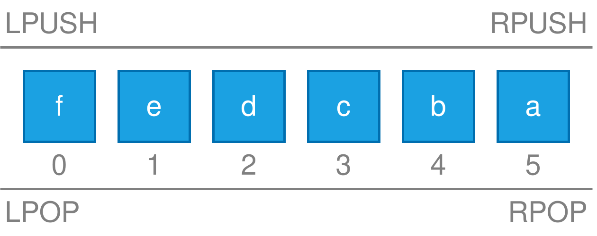

## Redis 数据类型

Redis 的五种基本数据类型：字符串、列表、集合、有序集合、哈希，以及三种高级数据类型：地理位置、HyperLogLog、位图。

### 字符串 String

### 列表 List

一个列表最多包含 $2^{32} - 1$（4294967295，超过40亿）

插入元素需要使用 `LPUSH` 或 `RPUSH` 命令，可以插入一个或多个元素。
```bash
LPUSH key element [element ...] # 从左边/头部插入元素
RPUSH key element [element ...] # 从右边/尾部插入元素
```

例如：
```bash
LPUSH letter a b c d e f
# (integer) 6
```

获取需要使用 `LRANGE` 命令：
```bash
LRANGE key start stop
```

如果 `start` 为 0，`stop` 为 -1，表示获取所有元素。例如：
```bash
LRANGE letter 0 -1
# 1) "f"
# ...
# 6) "a"
```
注意到元素的顺序是反的，因为在插入时是从左边依次插入的，所以最后插入的元素在最前面。

Redis 的列表是一个双向链表，如下图所示：



删除元素需要使用 `LPOP` 或 `RPOP` 命令，可以删除一个或多个元素。
```bash
LPOP key [count]
RPOP key [count]
```

例如：
```bash
LPOP letter # 默认从头部删除一个元素
# "f" #表示删除的元素
```

此外，可以使用 `BLPOP` 和 `BRPOP` 命令设置超时等待时间，单位为秒，命令格式如下：
```bash
BLPOP key [key ...] timeout
BRPOP key [key ...] timeout
```

`BLPOP` 和 `BRPOP` 全称是 Blocking Left/Right Pop （阻塞式左/右弹出）
- 如果元素不存在，则会阻塞等待，直到有元素可用或超时
- 如果超时，则返回 nil

例如：
```bash
BLPOP letter 0 # 0 表示不超时，会一直等待
# 1) "letter"
# 2) "e"
BLPOP letter 2 # 2 表示超时2秒
# 1) "letter"
# 2) "d"
```

可以使用 `LPUSH` 和 `RPOP` 命令在列表的头部和尾部插入和删除元素，这样就可以实现栈和队列的功能，实现一个简单的消息队列。

可以使用 `LLLEN` 命令获取列表的长度：
```bash
LLEN key
```

可以使用 `LINDEX` 命令获取指定位置的元素：
```bash
LINDEX key index
```

可以使用 `LSET` 命令设置指定位置的元素：
```bash
LSET key index element
```

可以使用 `LINSERT` 命令在指定位置插入元素：
```bash
LINSERT key BEFORE/AFTER pivot element
```

可以使用 `LREM` 命令删除指定数量的元素：
```bash
LREM key count element
```

可以使用 `LTRIM` 命令截取列表的指定范围：
```bash
LTRIM key start stop
```


列表相关的命令：
| 命令                                     | 说明                      |
| ---------------------------------------- | ------------------------- |
| `LPUSH key element [element ...]`        | 从左边/头部插入元素       |
| `RPUSH key element [element ...]`        | 从右边/尾部插入元素       |
| `LPOP key [count]`                       | 从左边/头部删除元素       |
| `RPOP key [count]`                       | 从右边/尾部删除元素       |
| `BLPOP key [key ...] timeout`            | 阻塞式从左边/头部删除元素 |
| `BRPOP key [key ...] timeout`            | 阻塞式从右边/尾部删除元素 |
| `LRANGE key start stop`                  | 获取指定范围的元素        |
| `LLEN key`                               | 获取列表的长度            |
| `LINDEX key index`                       | 获取指定位置的元素        |
| `LSET key index element`                 | 设置指定位置的元素        |
| `LINSERT key BEFORE/AFTER pivot element` | 在指定位置插入元素        |
| `LREM key count element`                 | 删除指定数量的元素        |
| `LTRIM key start stop`                   | 截取列表的指定范围        |


### 集合 Set

### 有序集合 Sorted Set

### 哈希 Hash

### 消息队列 Stream

### 地理位置 Geospatial
### HyperLogLog
### 位图 Bitmap
### 位域 Bitfield

